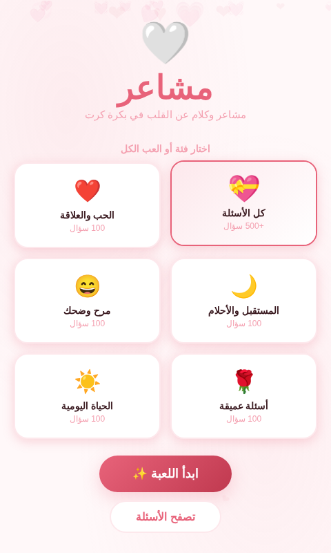
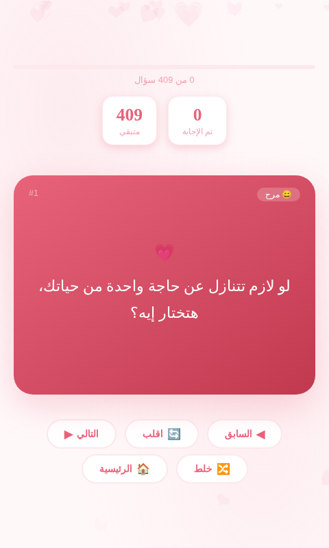
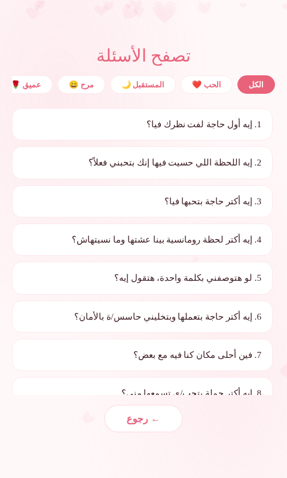

<div align="center">

# 💗 مشاعر — لعبة الأزواج

**مشاعر وكلام عن القلب في بكرة كرت**

لعبة أسئلة تفاعلية للأزواج، بواجهة عربية بالكامل (RTL)، مبنية بـ HTML/CSS/JS خالصة بدون أي مكتبات خارجية.

[](#)
[](#)
[](#)
[](#)

</div>

---

## 📖 عن المشروع

**مشاعر** هي لعبة كروت تفاعلية للأزواج، الفكرة إنكم تختاروا فئة أسئلة (أو تلعبوا كل الفئات مع بعض) وتقلبوا الكروت واحد ورا التاني، كل كرت فيه سؤال يفتح باب كلام وقرب أكتر بينكم. اللعبة فيها **409 سؤال** موزعين على 5 فئات مختلفة، بالإضافة لوضع تصفح يسمحلكم تشوفوا كل الأسئلة قبل ما تلعبوا.

المشروع عبارة عن صفحة واحدة (Single Page) شغالة بالكامل من غير أي Backend أو تثبيت — تفتح الملف وتلعب على طول.

## ✨ المميزات

- 🃏 **تجربة كروت تفاعلية** — كرت بيتقلب بأنيميشن ثلاثي الأبعاد عند الضغط عليه
- 📚 **409 سؤال** موزعة على 5 فئات:
  - ❤️ الحب والعلاقة (100 سؤال)
  - 🌙 المستقبل والأحلام (79 سؤال)
  - 😄 مرح وضحك (79 سؤال)
  - 🌹 أسئلة عميقة (75 سؤال)
  - ☀️ الحياة اليومية (76 سؤال)
- 🎯 **اختيار الفئة** — العب فئة واحدة أو كل الأسئلة مع بعض
- 🔀 **خلط الأسئلة** — ترتيب عشوائي في كل مرة
- 📊 **متابعة التقدم** — شريط تقدم وإحصائيات (تم الإجابة / متبقي)
- 🔍 **وضع تصفح** — استعراض كل الأسئلة مع فلترة حسب الفئة قبل اللعب
- 🎨 **تصميم عربي كامل (RTL)** — خطوط عربية أنيقة (Amiri & Tajawal) وألوان هادئة
- 📱 **متجاوب بالكامل** — شغال على الموبايل والتابلت والديسكتوب
- ⚡ **بدون تثبيت أو Backend** — ملف HTML واحد، افتحه وابدأ

## 🖼️ لقطات من اللعبة

| الشاشة الرئيسية | شاشة اللعب | تصفح الأسئلة |
|:---:|:---:|:---:|
|  |  |  |

> اللقطات مأخوذة من تشغيل فعلي للعبة. لو ضفت مجلد `screenshots/` بنفس الأسماء (`home.png`, `game.png`, `browse.png`) في جذر الريبو هتظهر تلقائيًا هنا.

## 🚀 طريقة التشغيل

اللعبة صفحة واحدة بدون أي متطلبات أو تثبيت.

### تشغيل مباشر

1. نزّل أو اعمل Clone للمشروع:
   ```bash
   git clone https://github.com/MRxAlc0h0lic/Mashaeir-game.git
   ```
2. افتح ملف `index.html` في أي متصفح.

### أو جرّب أونلاين

تقدر تستضيف الملف مباشرة عن طريق **GitHub Pages**:

1. من إعدادات الريبو (Settings) → Pages
2. اختار الـ Branch: `main` والمجلد: `/root`
3. احفظ، وهيبقى عندك رابط مباشر للعبة

## 🕹️ طريقة اللعب

1. من الشاشة الرئيسية، اختار فئة الأسئلة اللي عايزين تلعبوا بيها (أو "كل الأسئلة")
2. اضغط **ابدأ اللعبة ✨**
3. اضغط على الكرت عشان يتقلب ويظهر السؤال
4. استخدموا أزرار **التالي / السابق** للتنقل بين الأسئلة، أو **خلط** لترتيب عشوائي جديد
5. لما تخلصوا كل الأسئلة هتظهر شاشة نهاية مع رسالة تهنئة 🎉

كمان تقدروا تضغطوا **تصفح الأسئلة** من الشاشة الرئيسية عشان تشوفوا كل الأسئلة مقسمة حسب الفئة من غير ما تدخلوا وضع اللعب.

## 🛠️ التقنيات المستخدمة

- **HTML5** — هيكل الصفحة
- **CSS3** — كل التنسيقات والأنيميشن (Flip Cards, Transitions, Gradients) بدون أي Framework
- **JavaScript (Vanilla)** — منطق اللعبة بالكامل، بدون مكتبات خارجية
- **Google Fonts** — خطوط `Amiri` و `Tajawal` لتجربة عربية أنيقة

## 📂 هيكل المشروع

```
Mashaeir-game/
└── index.html   # الملف الوحيد — يحتوي على الـ HTML والـ CSS والـ JS كاملين
```

## 🤝 المساهمة

المساهمات مرحب بيها! لو عندك أفكار لأسئلة جديدة، فئات إضافية، أو تحسينات على التصميم:

1. اعمل Fork للمشروع
2. اعمل Branch جديد (`git checkout -b feature/amazing-feature`)
3. اعمل Commit للتعديلات (`git commit -m 'إضافة ميزة كذا'`)
4. ادفع للـ Branch (`git push origin feature/amazing-feature`)
5. افتح Pull Request

## 📄 الترخيص

هذا المشروع متاح تحت رخصة [MIT](LICENSE) — استخدمه وعدّل فيه بحرية.

## 👤 صاحب المشروع

**MRxAlc0h0lic**

- GitHub: [@MRxAlc0h0lic](https://github.com/MRxAlc0h0lic)

---

<div align="center">

صُنعت بـ 💗 لكل الأزواج اللي عايزين يتقربوا أكتر من بعض

</div>
